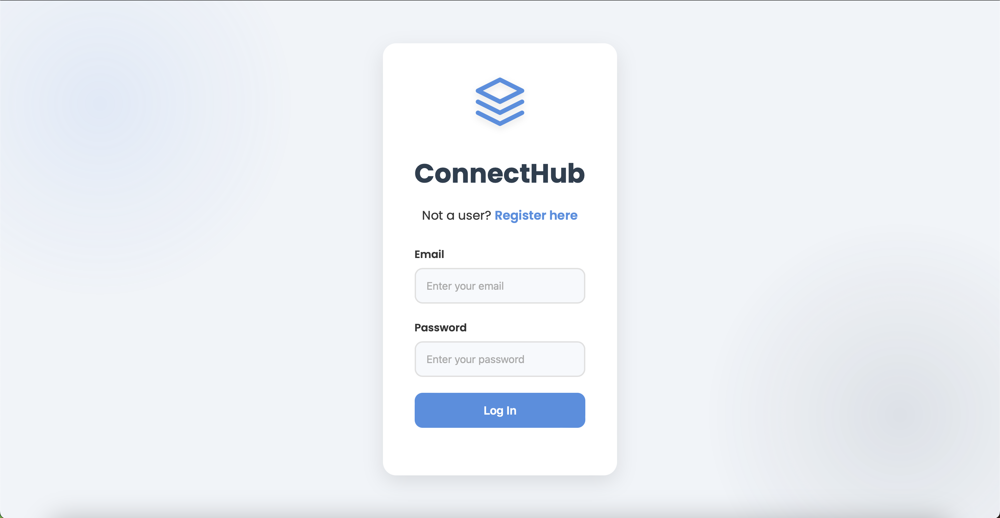
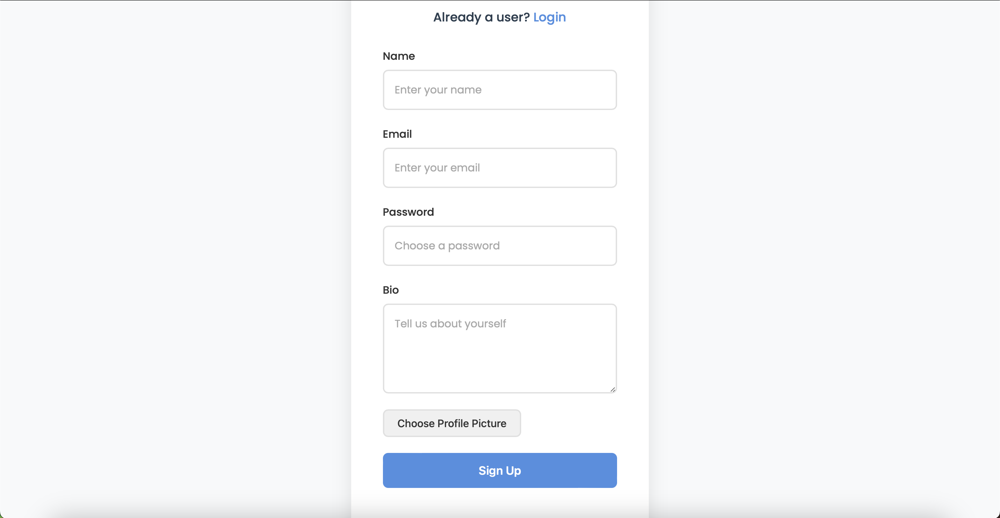
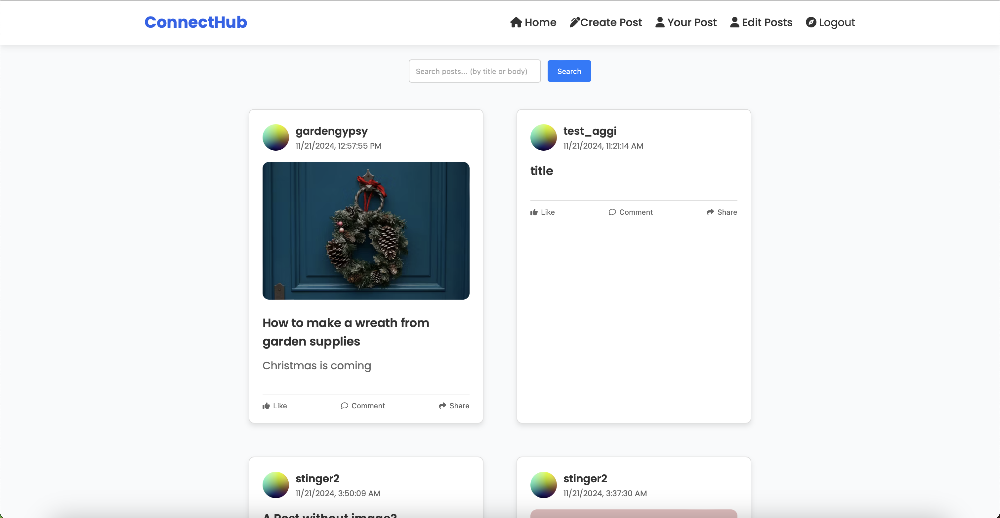
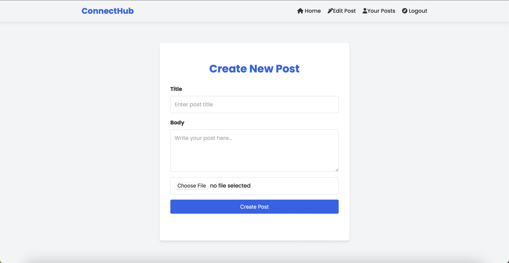
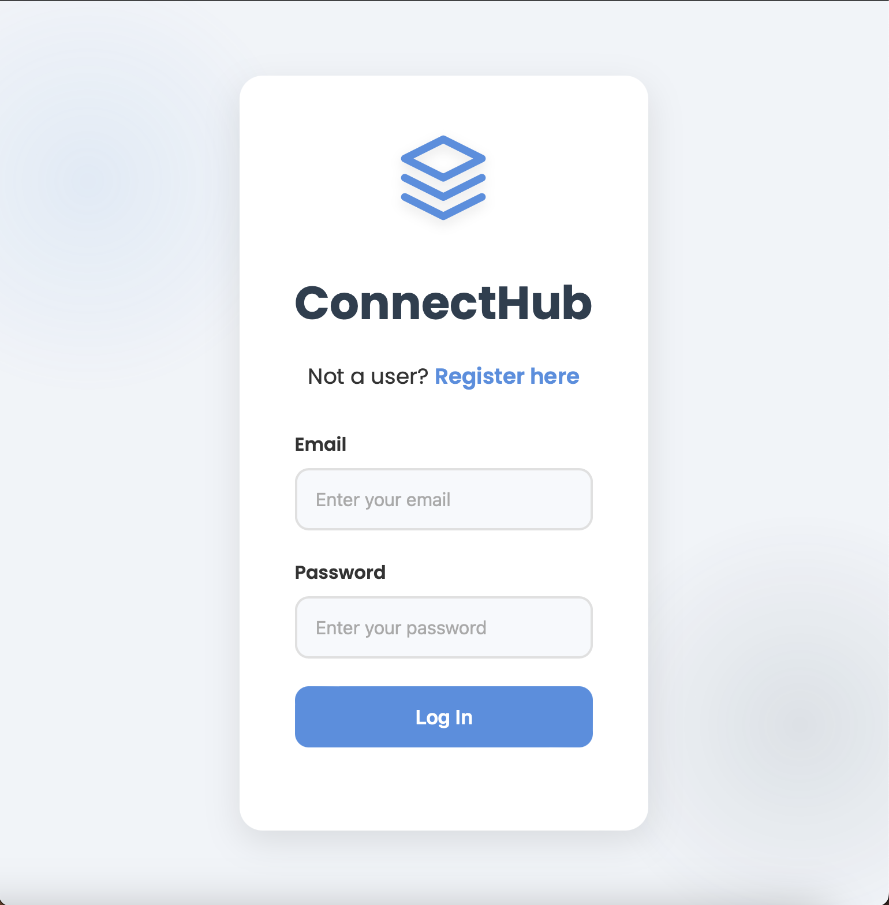

# Connect-Hub
[GitHub Pages Link](https://darthcoursucant.github.io/Connect-Hub/)

## Created With
    - HTML 
    - CSS  
    - JavaScript
    - Figma 
    - VS Code
    - Github & Github Pages

## What Is Connect Hub ?
- Connect Hub is a assignemnt from my second year at studying Front-End Development at Noroff Bergen
- Connect Hub is a new social media platform. You can create a account, login into your account, logout of your accoung, create posts and see other people's posts 

## How Does Sqaure Eyes Look Like For Desktop / Laptop Size Devices ?
### Login Feed On Desktop / Laptop

### Create Account Page On Desktop / Laptop

### Home Feed Page On Desktop / Laptop

### Create A Post Page On Desktop / Laptop

## How Does Sqaure Eyes Look Like For Phone size Devices ?
### Login Feed On Phone
